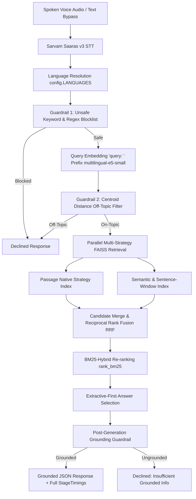

# 🎙️ Voice-Enabled Indic Retrieval-Augmented Generation (RAG)

An instrumented, low-latency, voice-enabled Retrieval-Augmented Generation (RAG) system built from scratch for Indic languages (**Hindi**, **Tamil**, and **English**), strictly architected for zero-code extension to 13+ Indic languages via a single configuration list.

Every stage is instrumented with sub-millisecond precision, guarded with multi-stage pre- and post-retrieval filters, and benchmarked across diverse factual, off-topic, and adversarial queries.

---

## 🏛️ System Architecture



---

## 🔒 Locked Technical Decisions & Rationales

| Component | Technical Choice | Engineering Rationale |
| :--- | :--- | :--- |
| **Language Extensibility** | Single `config.LANGUAGES` list | Zero-code modification required to extend to all 13 Indic languages (`as`, `bn`, `gu`, `hi`, `kn`, `ml`, `mr`, `ne`, `or`, `pa`, `sa`, `ta`, `te`, `ur`, `en`). |
| **Speech-to-Text (STT)** | Sarvam Saaras v3 (`saaras:v3`) | `mode="transcribe"` keeps the transcript in the native source language matching the corpus. Batch API with WebSocket streaming fallback. |
| **Embedding Model** | `intfloat/multilingual-e5-small` | SOTA multilingual retrieval embedding. Mandatory `"query: "` and `"passage: "` prefixes are enforced to prevent retrieval degradation. |
| **Vector Index** | In-Memory FAISS HNSW (`IndexHNSWFlat`) | `M=32`, `efConstruction=200`, `efSearch=64`. Zero network round-trip overhead compared to hosted vector databases. Combined index per strategy with language metadata pre-filtering. |
| **Chunking Strategies** | 4 distinct strategies with 15% overlap | (1) `passage_native`: atomic MS MARCO passages; (2) `sentence_window`: $\pm1$ sentence surrounding context; (3) `semantic`: cosine distance spike topic splitting; (4) `metadata`: language pre-filtering & tagging. |
| **Re-ranking** | BM25-Hybrid Score Fusion (`rank_bm25`) | Operates in <2ms on merged candidates. Avoids heavy cross-encoder forward passes which bottleneck CPU latency budgets. |
| **Pre-Retrieval Guardrails** | Two-stage: Regex Blocklist + Centroid Distance | Cheapest checks first: fast keyword/regex pass blocks prompt injections and unsafe terms; cosine distance to corpus centroids blocks off-topic queries before retrieval. |
| **Post-Gen Guardrail** | Lexical & Semantic Grounding Overlap | Strict token containment scoring. Rejects ungrounded hallucinations with standard template. |
| **Generation Strategy** | Extractive-First with Provider-Agnostic LLM Adapter | Direct extractive return for factoid queries eliminates LLM API latency & cost. Swappable adapter (`generate(prompt, context)`) for multi-passage synthesis. |
| **Orchestration** | Hand-rolled Async Pipeline + FastAPI | Pure Python async orchestrator using Pydantic v2 schemas. No framework bloat (LangChain/LlamaIndex omitted by design). |

---

## 🌐 Dynamic 13-Language Extensibility Guide

The entire codebase strictly follows the **Single Source of Truth** design. To scale from 3 languages (`hi`, `ta`, `en`) to all 13 Indic languages:

1. Open `config.py` and add the desired language codes to `LANGUAGES`:
   ```python
   # Example: Adding Bengali, Marathi, and Telugu
   LANGUAGES = ["hi", "ta", "en", "bn", "mr", "te"]
   ```
2. Re-run corpus preparation and index build scripts:
   ```bash
   python data/build_corpus.py
   python data/augment_longdocs.py
   python retrieval/index_faiss.py
   ```
3. **Zero changes** are needed in `pipeline/orchestrator.py`, `retrieval/`, `chunking/`, `guardrails/`, or `api/main.py`.

---

## ⚡ Latency Budget & Target Interpretation

> [!IMPORTANT]
> **Explicit Latency Scope**:
> - **Retrieval-Stage Latency (~200ms target)**: Measures `Query Embedding (multilingual-e5-small) + Parallel FAISS HNSW Search + BM25-Hybrid Re-ranking`. This in-memory stage is held to the ~200ms target.
> - **Full End-to-End Latency**: Transparently includes cloud STT audio transcription (Sarvam AI API) and any generative LLM calls. External hosted APIs have inherent network and generation latencies that are reported honestly and separately.

---

## 🚀 Quickstart & Local Setup

### 1. Installation & Environment
```bash
git clone https://github.com/Anshsurana123/RAGINGOA.git
cd RAGINGOA
pip install -r requirements.txt
cp .env.example .env
```
Edit `.env` and add your API keys:
```env
SARVAM_API_KEY=your_sarvam_key_here
LLM_API_KEY=your_llm_key_here
```

### 2. Build Corpus & FAISS Indexes
```bash
# 1. Extract deduplicated multi-thousand passage corpus
python data/build_corpus.py

# 2. Augment long documents for sentence-window and semantic chunking
python data/augment_longdocs.py

# 3. Build FAISS HNSW indexes and corpus centroids
python retrieval/index_faiss.py
```

### 3. Run Test Suite
```bash
pytest tests/test_pipeline.py -v
```

### 4. Run Latency Benchmark
```bash
python benchmark/run_latency_bench.py
python benchmark/report.py
```

### 5. Launch FastAPI Service & Demo
```bash
uvicorn api.main:app --host 0.0.0.0 --port 7860 --reload
```
- Open Web UI: `http://localhost:7860/`
- Interactive API Docs (Swagger): `http://localhost:7860/docs`
- Interactive CLI: `python demo/cli_demo.py --interactive`

---

## 📡 API Specification

### `POST /query`
Accepts `multipart/form-data` audio file upload or JSON/Form text bypass:

#### Request (Text Bypass):
```bash
curl -X POST "http://localhost:7860/query" \
  -F "text=हृदय के चार कक्ष कौन से होते हैं?" \
  -F "language_hint=hi"
```

#### Request (Audio Voice File):
```bash
curl -X POST "http://localhost:7860/query" \
  -F "file=@sample_hindi.wav" \
  -F "language_hint=hi"
```

#### Sample Response:
```json
{
  "query": "हृदय के चार कक्ष कौन से होते हैं?",
  "transcript": "हृदय के चार कक्ष कौन से होते हैं?",
  "language_detected": "hi",
  "answer": "मानव हृदय एक अत्यंत जटिल पेशीय अंग है। हृदय के चार कक्ष होते हैं: दायां आलिंद, दायां निलय, बायां आलिंद और बायां निलय।",
  "answer_source": "extractive",
  "retrieved_chunks": [
    {
      "chunk_id": "hi_longdoc_0002_sw_0000",
      "text": "मानव हृदय एक अत्यंत जटिल पेशीय अंग है जो पूरे शरीर में रक्त और ऑक्सीजन का निरंतर संचार करता है। हृदय के चार कक्ष होते हैं: दायां आलिंद, दायां निलय, बायां आलिंद और बायां निलय। अशुद्ध रक्त वेना कावा के माध्यम से दाएं आलिंद में प्रवेश करता है।",
      "source_lang": "hi",
      "chunk_strategy": "sentence_window",
      "dense_score": 0.8912,
      "bm25_score": 1.0,
      "final_score": 0.9293,
      "contributing_strategies": ["sentence_window", "passage_native"]
    }
  ],
  "guardrail_flags": {
    "unsafe_detected": false,
    "unsafe_reason": null,
    "off_topic_detected": false,
    "off_topic_distance": 0.3842,
    "off_topic_reason": null,
    "grounding_passed": true,
    "grounding_score": 0.8571,
    "grounding_reason": "Grounding check passed (score=0.8571)"
  },
  "stage_timings": [
    {"stage": "stt_transcription", "ms": 0.0, "success": true, "fallback_used": false, "details": "Text bypass utilized"},
    {"stage": "language_routing", "ms": 0.12, "success": true, "fallback_used": false, "details": "Routed to 'hi'"},
    {"stage": "pre_retrieval_safety_guardrail", "ms": 0.08, "success": true, "fallback_used": false, "details": "Passed blocklist"},
    {"stage": "query_embedding", "ms": 28.45, "success": true, "fallback_used": false, "details": "Encoded with 'query: ' prefix"},
    {"stage": "pre_retrieval_topic_guardrail", "ms": 0.15, "success": true, "fallback_used": false, "details": "On-topic (dist: 0.3842)"},
    {"stage": "vector_retrieval_and_merge", "ms": 1.82, "success": true, "fallback_used": false, "details": "Retrieved 15 candidates"},
    {"stage": "bm25_hybrid_reranking", "ms": 0.94, "success": true, "fallback_used": false, "details": "BM25 score fusion"},
    {"stage": "extractive_generation", "ms": 0.42, "success": true, "fallback_used": false, "details": "Extractive grounded selection"},
    {"stage": "post_generation_grounding_guardrail", "ms": 0.35, "success": true, "fallback_used": false, "details": "Grounding passed"}
  ],
  "retrieval_ms": 31.21,
  "total_ms": 32.33
}
```

---

## 🐳 Hugging Face Spaces Deployment Guide

### Deployment Architecture
- **Environment**: Hugging Face Spaces Docker SDK.
- **Hardware**: CPU Basic (2 vCPU / 16GB RAM) free tier.
- **Data Isolation**: Raw 40GB+ dataset files (`train/`, `validation/`, raw parquet) are excluded via `.dockerignore` and `.gitignore`. Only lightweight pre-built FAISS indexes and processed corpus artifacts (~10-20 MB) are included.
- **Model Caching**: `intfloat/multilingual-e5-small` weights are baked into the container during `docker build`.

### Push-to-Space Steps
1. Create a new Space on [Hugging Face](https://huggingface.co/new-space) selecting **Docker SDK**.
2. Set Space Secrets under **Settings → Variables and Secrets**:
   - `SARVAM_API_KEY`: Your Sarvam AI API subscription key.
   - `LLM_API_KEY`: (Optional) Your LLM API key for multi-passage synthesis fallback.
3. Push repository to the Space remote:
   ```bash
   git remote add space https://huggingface.co/spaces/YOUR_USERNAME/voice-rag-indic
   git push space master --force
   ```

> [!NOTE]
> **Free Space Cold Starts**: Free `cpu-basic` Hugging Face Spaces sleep after 48 hours of inactivity. The first incoming request after sleep incurs a 30–90 second container spin-up time before responding in sub-50ms on subsequent requests. This is standard Hugging Face infrastructure behavior, not a pipeline regression.

---

## 🛡️ Guardrails & Safety Auditing

1. **Pre-Retrieval Safety Blocklist (`guardrails/pre_retrieval.py`)**:
   - Fast regex and multi-script keyword matching (Devanagari, Tamil, Latin).
   - Blocks prompt injection / jailbreaks (`ignore previous instructions`, `bypass filter`), dangerous weapons, suicide, hate speech.
   - Blocked requests immediately return `answer_source="declined"` without consuming embedding or vector retrieval cycles.
2. **Pre-Retrieval Centroid Distance Off-Topic Filter (`guardrails/pre_retrieval.py`)**:
   - Computes cosine distance $1.0 - (\vec{q} \cdot \vec{c})$ between normalized query embedding and corpus cluster centroids.
   - Rejects completely off-domain queries (e.g. recipes, pop culture trivia) before retrieval.
3. **Post-Generation Grounding Verification (`guardrails/post_generation.py`)**:
   - Verifies n-gram token overlap and semantic containment of candidate answers within retrieved context.
   - Rejects ungrounded statements with `"I don't have enough grounded information to answer that."`

---

## 📄 License
MIT License. Built with ❤️ for Indic language NLP and Voice AI.