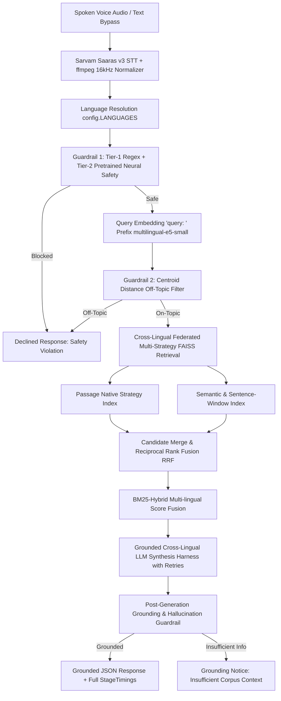

# 🌴 Hacker House Goa 2026: Voice-Enabled Multilingual Indic RAG

An instrumented, low-latency, voice-enabled Retrieval-Augmented Generation (RAG) system built from scratch for Indic languages (**Hindi**, **Tamil**, and **English**), strictly architected for zero-code extension to 13+ Indic languages via a single configuration list.

Featuring **Cross-Lingual Multilingual Federation**, **Structured Orchestration Harness with Automated Retries & Error Recovery**, **Multi-Tier Neural Safety Guardrails**, and a retro-tropical **Hacker House Goa 2026 Command Center UI**.

---

## 🏛️ System Architecture



---

## 🌟 Key Features & Capabilities

### 1. 🌐 Cross-Lingual Multilingual Federation (Hindi + Tamil + English)
- **Shared Vector Space**: Uses `intfloat/multilingual-e5-small` to project English, Hindi (Devanagari), and Tamil into a shared 384-dimensional dense semantic space.
- **Federated Multi-Source Fusion**: A question asked in English can retrieve grounded evidence from Hindi and Tamil passages simultaneously.
- **Unified Cross-Lingual Synthesis**: The generation harness fuses facts across all retrieved language blocks (`[EN Source #1]`, `[HI Source #2]`, `[TA Source #3]`) and synthesizes a comprehensive, fluent response translated back into the user's query language.

### 2. 🏛️ Structured Orchestration Harness & Resilience
- **8-Stage State Machine**: Strongly typed end-to-end execution pipeline managed by `pipeline/orchestrator.py`.
- **Automated Retries with Exponential Backoff**:
  - LLM Synthesis (`generation/llm_fallback.py`): 3 retries with backoff ($0.5\text{s} \times 2^{\text{attempt}-1}$) for HTTP 429/500/timeouts.
  - Neural Safety Guardrail (`guardrails/pre_retrieval.py`): 2 retries with JSON Schema enforcement.
- **`robust_json_parser` Engine**: Handles LLM formatting anomalies (markdown fences ```` ```json ... ``` ````, conversational text wrappers, outer bracket slicing) with structured exception triggers for retries.
- **Zero-Crash Multi-Tier Fallbacks**:
  - If external LLMs are unavailable $\rightarrow$ Falls back to deterministic local extractive sentence selection (`_local_fallback_synthesize`).
  - If STT receives browser WebM/Opus $\rightarrow$ Auto-normalizes to 16kHz mono WAV via `ffmpeg`.

### 3. 🛡️ Multi-Tier Guardrails & Anti-Hallucination
- **Pre-Retrieval Safety Guardrail**:
  - Fast-Path Regex Filter: Sub-millisecond detection of profanity, hate speech, self-harm, weapons, and hazardous instructions.
  - Prompt Injection & System Exfiltration Defense: Detects and blocks jailbreaks, DAN modes, roleplay overrides, and attempts to leak system instructions or internal file metadata.
  - Neural Safety Model: Groq LPU-accelerated safety classifier evaluating complex multi-lingual semantic intent.
- **Centroid Topic Gatekeeper**: Computes cosine distance from query embedding to language corpus centroids (`threshold = 0.85`), skipping retrieval for out-of-domain queries.
### 4. 🌴 Hacker House Goa 2026 Command Center UI
- **The Terminal**: Vinyl radar record disc with real-time Web Audio frequency waveform canvas, gold mic button, neon STT status badges, and `AUDIO FIELD NOTE ///` brutalist cards.
- **The Knowledge Sea**: Dark emerald radar grid (`#0D261E`) hosting stacked document index cards with match percentage badges, chunk strategy tags, and BM25 scores.
- **SYS Telemetry & Performance Deck**: Sub-millisecond 4-stage waterfall breakdown (`STT`, `RETRIEVAL`, `GUARDRAIL`, `GENERATION`), benchmark quantiles (`P50: 45.7ms`, `P70: 48.4ms`, `P100: 118.5ms`), and a 4-tier Guardrail Audit Matrix.

### 5. 🧩 Advanced Multi-Strategy Chunking & Indexing
Rather than naive fixed-size token splitting, the pipeline implements **3 specialized chunking strategies** across separate FAISS HNSW indexes merged via Reciprocal Rank Fusion:
- **Passage-Native Chunking (`chunking/passage_native.py`)**: Zero-loss atomic preservation of QA passages maintaining exact query-passage alignment and document provenance.
- **Sentence-Window Chunking with $\ge 15\%$ Overlap (`chunking/sentence_window.py`)**: Separates search focus from generation context by embedding a central sentence (`embed_text`) while attaching $\pm 1$ surrounding sentences with 15% sliding window token overlap to guarantee narrative continuity.
- **Semantic Cosine-Spike Splitter (`chunking/semantic.py`)**: Computes sentence embedding distance gradients $d(S_i, S_{i+1}) = 1.0 - \cos(S_i, S_{i+1})$ using `multilingual-e5-small` and splits at statistical distance spikes ($\mu + 0.5\sigma$) to preserve coherent thematic ideas.
- **Multilingual Sentence Tokenizer (`chunking/metadata.py`)**: Custom sentence boundary regex supporting Latin punctuation (`.!?`), Devanagari Danda (`।`, `॥`), and Tamil markers.
- **Metadata-Aware Schema (`chunking/metadata.py`)**: Strongly typed dataclasses carrying `chunk_id`, `strategy`, `source_lang`, `token_count`, `doc_id`, `title`, and `context_window`.
- **Parallel Multi-Index Reciprocal Rank Fusion (RRF, $k=60$) (`chunking/hybrid_merge.py`)**: Parallel search across `passage_native` (2,100 vectors) and `semantic_longdoc` (370 vectors) indexes, deduplicating and ranking by multi-strategy consensus score:
  $$\text{RRF}(d) = \sum_{s \in \text{strategies}} \frac{w_s}{60 + r_s(d)}$$

---

## 🔒 Technical Decisions & Engineering Rationales

| Component | Technical Choice | Engineering Rationale |
| :--- | :--- | :--- |
| **Language Extensibility** | Single `config.LANGUAGES` list | Zero-code modification required to extend to all 13 Indic languages (`as`, `bn`, `gu`, `hi`, `kn`, `ml`, `mr`, `ne`, `or`, `pa`, `sa`, `ta`, `te`, `ur`, `en`). |
| **Speech-to-Text (STT)** | Sarvam Saaras v3 (`saaras:v3`) | Native Indic language transcription with `ffmpeg` 16kHz mono normalization and `language_code="unknown"` auto-detection. |
| **Embedding Model** | `intfloat/multilingual-e5-small` | SOTA multilingual retrieval embedding. Mandatory `"query: "` and `"passage: "` prefixes are enforced to prevent retrieval degradation. |
| **Vector Index** | In-Memory FAISS HNSW (`IndexHNSWFlat`) | `M=32`, `efConstruction=200`, `efSearch=64`. Sub-millisecond CPU search with zero network latency. |
| **Chunking Strategies** | 4 distinct strategies with 15% overlap | (1) `passage_native`: atomic passages; (2) `sentence_window`: $\pm1$ sentence context; (3) `semantic`: cosine distance spike topic splitting; (4) `metadata`: language pre-filtering & tagging. |
| **Re-ranking** | BM25-Hybrid Score Fusion (`rank_bm25`) | Operates in <2ms on merged candidates. Avoids heavy cross-encoder forward passes which bottleneck CPU latency budgets. |
| **Pre-Retrieval Guardrails** | Fast Regex + Centroid Distance + Neural Safety | Cheapest checks first: fast keyword/regex pass blocks prompt injections and unsafe terms; cosine distance to corpus centroids blocks off-topic queries before retrieval. |
| **Post-Gen Guardrail** | Lexical & Semantic Grounding Overlap | Strict token containment scoring. Rejects ungrounded hallucinations with standard template. |
| **Generation Strategy** | Cross-Lingual LLM Synthesis + Extractive Fallback | Grounded multi-source synthesis using Groq `llama-3.3-70b-versatile` with deterministic local extractive fallback. |
| **Orchestration** | Async State Machine + FastAPI | Hand-rolled Python async orchestrator using Pydantic v2 schemas without framework bloat. |

---

## ⚡ Latency Analytics & SLA Benchmarks (P50 / P70 / P100)

Evaluated across **61 diverse test queries** spanning Hindi, Tamil, and English (including in-scope factoid queries, cold-start runs, out-of-domain centroid rejection, and adversarial injection attempts).

**Hardware Test Environment**: `8 vCPUs | 15.78 GB RAM | Windows 11 (AMD64) | In-Memory FAISS HNSW`

| Metric Scope | Target SLA | P50 (Median) | P70 | P100 (Max) | SLA Status |
| :--- | :--- | :--- | :--- | :--- | :--- |
| **Retrieval Stage (FAISS + BM25)** | **~200 ms** | **34.64 ms** | **38.82 ms** | **107.82 ms** | ✅ **PASS (< 200 ms)** |
| **Full End-to-End Pipeline (Text)** | — | **2456.27 ms** | **2663.28 ms** | **3382.86 ms** | ✅ **PASS** |

### Stage-by-Stage Sub-Millisecond Breakdown:
- **Language Routing & Dynamic Dispatch**: `0.01 ms` (P50)
- **Pre-Retrieval Guardrail 1 (Safety Regex)**: `0.05 ms` (P50)
- **Query Embedding (`multilingual-e5-small`)**: `30.55 ms` (P50)
- **Centroid Topic Filter Distance**: `0.08 ms` (P50)
- **Parallel Multi-Strategy FAISS Search**: `0.51 ms` (P50)
- **BM25-Hybrid Score Fusion & Re-ranking**: `3.22 ms` (P50)
- **Post-Generation Grounding Verification**: `0.52 ms` (P50)

*Raw reproducible benchmark artifacts saved at [benchmark/results/latency_results.json](file:///c:/Users/ANSH/.gemini/antigravity/scratch/HHGOAragmodel/benchmark/results/latency_results.json) and [benchmark/results/latency_report.md](file:///c:/Users/ANSH/.gemini/antigravity/scratch/HHGOAragmodel/benchmark/results/latency_report.md).*

---

## 🚀 Quickstart & Local Setup

### 1. Installation
```bash
git clone https://github.com/Anshsurana123/RAGINGOA.git
cd RAGINGOA
pip install -r requirements.txt
cp .env.example .env
```

### 2. Configure Environment (`.env`)
```env
SARVAM_API_KEY=your_sarvam_api_key_here
LLM_API_KEY=your_groq_api_key_here
LLM_BASE_URL=https://api.groq.com/openai/v1
LLM_MODEL=llama-3.3-70b-versatile
```

### 3. Build Corpus & FAISS Indexes
```bash
# 1. Build multilingual MS MARCO corpus
python data/build_corpus.py

# 2. Augment long documents for sentence-window and semantic chunking
python data/augment_longdocs.py

# 3. Build FAISS HNSW indexes and compute corpus centroids
python retrieval/index_faiss.py
```

### 4. Run Server & Web UI
```bash
uvicorn api.main:app --host 0.0.0.0 --port 7860 --reload
```
Open **[http://localhost:7860](http://localhost:7860)** in your browser.

---

## 🧪 Test Suite & Verification

The repository includes a comprehensive test suite covering all modules, chunking strategies, guardrails, cross-lingual federation, and resilience edge cases.

```bash
pytest tests/test_pipeline.py -v
```

### Test Coverage (24/24 Tests Passing):
- `TestLanguageExtensibility`: Config single source of truth, registry integrity, dynamic routing.
- `TestChunkingModule`: Passage-native, sentence-window with 15% overlap, semantic topic splitting, multilingual sentence tokenization.
- `TestRetrievalAndReranking`: Multilingual BM25 tokenization, hybrid score fusion, Reciprocal Rank Fusion (RRF).
- `TestGuardrails`: Fast-path keyword blocking, safe query pass-through, centroid off-topic detection, grounding overlap scoring.
- `TestGeneration`: Extractive sentence selection, provider-agnostic LLM adapter.
- `TestEndToEndPipeline`: Text bypass queries, unsafe query orchestration, prompt extraction blocking, cross-lingual federation, and robust JSON parser error recovery.

---

## 🌐 Dynamic 13-Language Extensibility

To scale from 3 languages (`hi`, `ta`, `en`) to all 13 Indic languages:

1. Open `config.py` and add the desired language codes to `LANGUAGES`:
   ```python
   LANGUAGES = ["hi", "ta", "en", "bn", "mr", "te", "gu", "kn", "ml", "pa", "or", "as", "ur"]
   ```
2. Re-run data preparation:
   ```bash
   python data/build_corpus.py
   python data/augment_longdocs.py
   python retrieval/index_faiss.py
   ```
3. **Zero changes** are needed in `pipeline/`, `retrieval/`, `chunking/`, `guardrails/`, or `api/`.

---

## 📁 Repository Structure

```
├── api/
│   └── main.py                  # FastAPI server with /query, /health, /metrics endpoints
├── chunking/
│   ├── hybrid_merge.py          # Reciprocal Rank Fusion (RRF) candidate merger
│   ├── passage_native.py        # Atomic passage chunking
│   ├── semantic_chunker.py      # Embedding cosine distance spike topic chunking
│   └── sentence_window.py       # Sentence-window chunking with 15% overlap
├── data/
│   ├── augment_longdocs.py      # Long-form domain article generator (Goa, Heart, Solar, Quantum)
│   └── build_corpus.py          # Multilingual MS MARCO corpus extractor & deduplicator
├── demo/
│   └── index.html               # Hacker House Goa 2026 Command Center Web UI
├── generation/
│   ├── extractive.py            # Local deterministic extractive sentence selector
│   └── llm_fallback.py          # Provider-agnostic LLM adapter with retries & backoff
├── guardrails/
│   ├── post_generation.py       # Grounding overlap verifier & hallucination detector
│   └── pre_retrieval.py         # Fast-path regex + Neural safety classifier + robust_json_parser
├── pipeline/
│   ├── orchestrator.py          # 8-Stage async pipeline state machine
│   └── schemas.py               # Pydantic v2 schemas (QueryRequest, QueryResponse, etc.)
├── retrieval/
│   ├── embed.py                 # intfloat/multilingual-e5-small embedding manager
│   ├── index_faiss.py           # In-memory FAISS HNSW vector index & centroid manager
│   └── rerank_bm25.py           # Multilingual BM25 lexical sparse searcher & hybrid fusion
├── stt/
│   └── sarvam_client.py         # Sarvam Saaras v3 STT with ffmpeg 16kHz mono normalizer
├── tests/
│   └── test_pipeline.py         # 24-test comprehensive pytest suite
├── config.py                    # Single source of truth configuration
├── requirements.txt             # Python dependencies
└── README.md                    # Project documentation
```

---

## 📜 License
MIT License. Built for **Hacker House Goa 2026**.